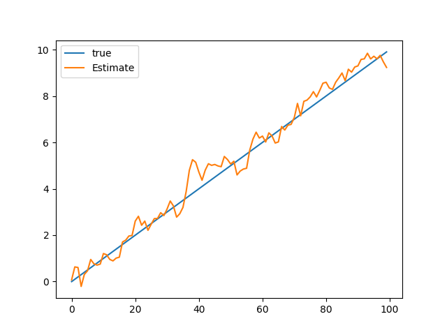

<H3>ENTER YOUR NAME : Kavinraja D</H3>
<H3>ENTER YOUR REGISTER NO : 212222240047.</H3>
<H3>EX. NO.5</H3>
<H3>DATE:</H3>
<H1 ALIGN =CENTER> Implementation of Kalman Filter</H1>
<H3>Aim:</H3> To Construct a Python Code to implement the Kalman filter to predict the position and velocity of an object.
<H3>Algorithm:</H3>
Step 1: Define the state transition model F, the observation model H, the process noise covariance Q, the measurement noise covariance R, the initial state estimate x0, and the initial error covariance P0.<BR>
Step 2:  Create a KalmanFilter object with these parameters.<BR>
Step 3: Simulate the movement of the object for a number of time steps, generating true states and measurements. <BR>
Step 3: For each measurement, predict the next state using kf.predict().<BR>
Step 4: Update the state estimate based on the measurement using kf.update().<BR>
Step 5: Store the estimated state in a list.<BR>
Step 6: Plot the true and estimated positions.<BR>
<H3>Program:</H3>


```py
import numpy as np
import matplotlib.pyplot as plt
class KalmanFi1ter:
    def __init__(self, F, H, Q, R, x0, P0):
        self.F=F
        self.H=H
        self.Q=Q
        self.R=R
        self.x=x0
        self.P=P0
    def predict (self):
        self.x=np.dot(self.F,self.x)
        self.P=np.dot(np.dot(self. F,self. P),self.F.T)+self.Q
    def update(self,z):
        y=z-np.dot(self.H,self.x)
        s=np.dot(np.dot(self.H,self.P),self.H.T)+self.R
        K=np.dot(np.dot(self.P,self.H.T),np.linalg.inv(s))
        self.x=self.x+np.dot(K,y)
        self.P=np.dot(np.eye(self.F.shape[0])-np.dot(K,self.H),self.P)
dt=0.1
F=np.array([[1,dt],[0,1]])
H=np.array([[1,0]])
Q=np.diag([0.1,0.1])
R=np.array([[1]])
x0=np.array([0,0])
P0=np.diag([1,1])
kf=KalmanFi1ter(F,H,Q,R,x0,P0)
truestates=[]
measurements=[]
for i in range(100):
    truestates.append([i*dt,1])
    measurements.append(i*dt+np.random.normal(scale=1))
est_states=[]
for z in measurements:
    kf.predict()
    kf.update(np.array([z]))
    est_states.append(kf.x)
plt.plot([s[0] for s in truestates],label="true")
plt.plot([s[0] for s in est_states],label="Estimate")
plt.legend()
plt.show()
```


<H3>Output:</H3>




<H3>Results:</H3>
Thus, Kalman filter is implemented to predict the next position and   velocity in Python


